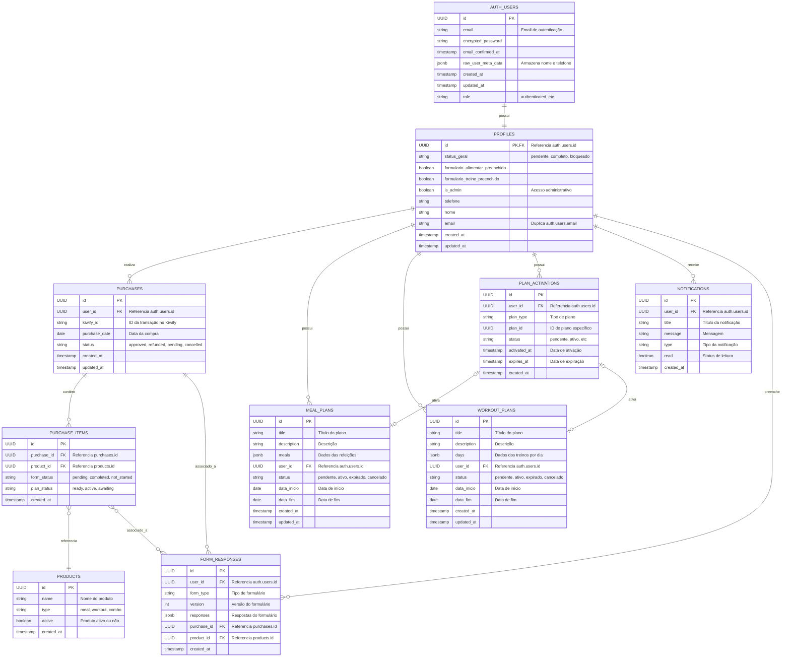
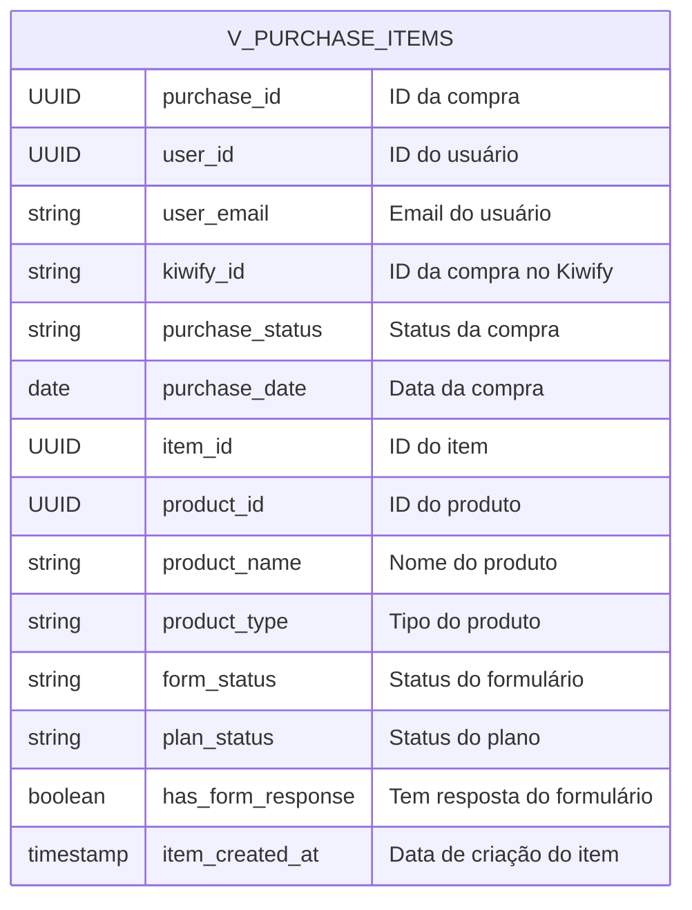

# Diagrama ERD do Banco de Dados

Este documento apresenta o Diagrama de Entidade-Relacionamento (ERD) detalhado do banco de dados do sistema Meu Plano Saúde.

## Diagrama Conceitual

## Visões (Views)

## Constraints e Políticas

1. **Chaves Estrangeiras**:
   - profiles.id → auth.users.id (1:1)
   - purchases.user_id → auth.users.id (N:1)
   - purchase_items.purchase_id → purchases.id (N:1)
   - purchase_items.product_id → products.id (N:1)
   - form_responses.user_id → auth.users.id (N:1)
   - form_responses.purchase_id → purchases.id (N:1)
   - form_responses.product_id → products.id (N:1)
   - plan_activations.user_id → auth.users.id (N:1)
   - notifications.user_id → auth.users.id (N:1)
   - meal_plans.user_id → auth.users.id (N:1)
   - workout_plans.user_id → auth.users.id (N:1)

2. **Row Level Security (RLS)**:
   - profiles: Usuários só podem acessar seu próprio perfil
   - notifications: Usuários só podem ver suas próprias notificações
   - form_responses: Usuários só podem ver suas próprias respostas
   - log_agente_automacao: Apenas usuários admin podem ver logs
   - plan_activations: Apenas admin pode acessar

3. **Triggers**:
   - on_auth_user_created: Cria perfil automaticamente após inserção em auth.users
   - trg_update_profile_status: Atualiza status do perfil baseado em flags

## Fluxo de Dados Principal

1. Usuário é criado em `auth.users` (através do Supabase Auth)
2. Trigger cria automaticamente um registro em `profiles`
3. Quando uma compra é realizada:
   - Registro na tabela `purchases`
   - Itens individuais em `purchase_items`
   - Usuário preenche formulários registrados em `form_responses`
   - Profissionais criam planos em `meal_plans` e/ou `workout_plans`
   - Planos são ativados através de `plan_activations`

## Notas Importantes

- O identificador único principal é o `id` (UUID) de `auth.users`
- O email é armazenado em `auth.users.email` e duplicado em `profiles.email`
- As compras são identificadas externamente pelo `kiwify_id`
- Todas as tabelas usam UUID como chave primária
- A maioria das tabelas possui campos de auditoria (created_at, updated_at)
- Dados complexos são armazenados como JSONB (ex: meals, days, responses) 